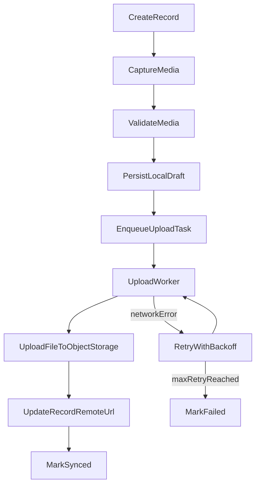

# 媒体流水线设计（采集 -> 本地 -> 上传 -> 回写）

## 流水线总览

## 模块职责
- `MediaCaptureService`：调用拍照/录像/选取能力，返回临时文件信息
- `MediaValidationService`：校验大小、时长、MIME、分辨率
- `RecordRepository`：持久化记录草稿与状态
- `UploadQueueService`：管理上传任务、重试、取消
- `StorageGateway`：上传媒体到对象存储
- `RecordSyncService`：回写 `remoteUrl`，更新记录状态

## 上传队列策略
- 并发度：默认 `1`（MVP 保守，降低并发冲突）
- 重试策略：指数退避（2s / 5s / 10s），最多 3 次
- 网络策略：
  - 无网：任务停留 `queued`
  - 恢复网络：自动恢复队列
  - 弱网超时：记一次失败并重试

## 文件与状态一致性
- 记录先写本地，上传独立异步执行
- 媒体上传成功后才写入 `remoteUrl`
- 所有媒体成功后，记录状态设为 `synced`
- 任一媒体失败，记录状态 `failed` 并记录 `failReason`

## 错误恢复
- 用户手动重试：`failed -> queued`
- 应用重启恢复：启动时扫描 `queued/uploading` 并重入队列
- 媒体文件缺失：标记 `failed`，提示用户重新选择媒体

## 观测指标（MVP 最小）
- 上传成功率
- 平均上传耗时
- 失败原因分布（超时/权限/格式/大小）
