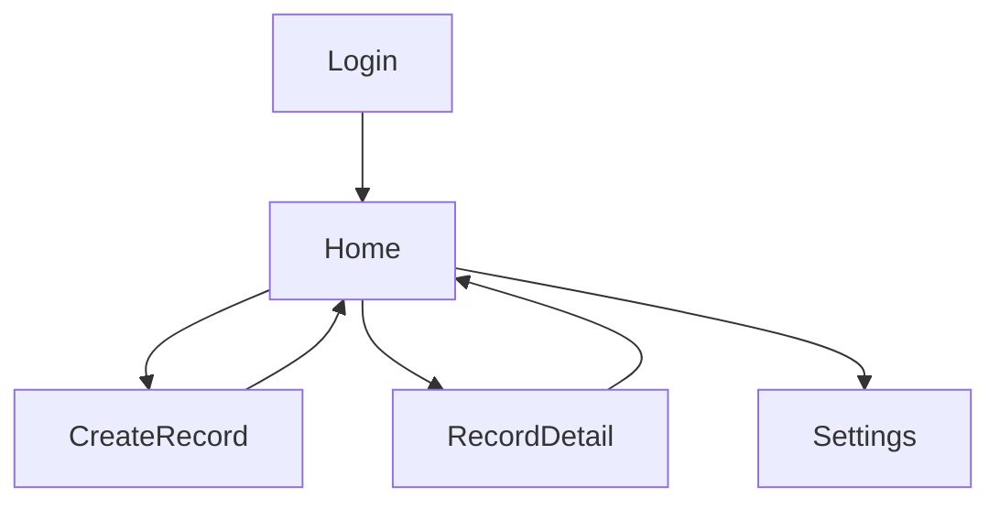

# PRD（前端）｜日行一善（Good Deeds）rixingyishan-ui（MVP）

> 本文为前端 PRD，面向 `uni-app + Vue3 + TS` 子工程：`rixingyishan-ui/`。  
> 后端 PRD 见：`docs/prd/2026-04-30-good-deeds-prd-service.md`。  
> 总览索引见：`docs/prd/2026-04-30-good-deeds-prd.md`。

## 1. 目标与范围（前端）
- 覆盖端：App(iOS/Android)、H5、微信小程序（优先）
- 核心能力：登录、创建记录（文/图/视频）、按天浏览、详情、设置、同步队列与错误恢复
- 明确不做：已同步记录编辑、社区、复杂搜索、视频编辑

## 2. 页面与导航
### 2.1 页面清单
- 首页（日历+当天列表）：`rixingyishan-ui/src/pages/index/index.vue`
- 新建记录：`rixingyishan-ui/src/pages/create-record/create-record.vue`
- 记录详情：`rixingyishan-ui/src/pages/record-detail/record-detail.vue`
- 设置：`rixingyishan-ui/src/pages/settings/settings.vue`
- 登录（待新增）：`rixingyishan-ui/src/pages/login/login.vue`
- 协议/隐私（可选 WebView，待新增）

### 2.2 跳转关系

## 3. 核心流程（前端）
### 3.1 登录（手机号验证码）
- 登录成功后：
  - 拉取当月 dayKey（用于日历打点）
  - 拉取选中日/今天列表
  - 恢复队列并开始同步

### 3.2 新建记录（local-first）
- 内容必填，媒体可选（可多次添加，形成 0..N）
- 保存即落本地（离线可用）
- 若有媒体则进入队列：`queued -> uploading -> synced/failed`

### 3.3 退出登录（固定方案 A）
- 仅清 token/用户态，不删除本地记录与媒体
- 本地记录标记「未绑定当前账号」
- 再次登录时弹窗询问是否合并上传（确认后批量入队）

## 4. 状态与数据（前端）
### 4.1 本地数据结构
- 以 `rixingyishan-ui/src/types/index.ts` 为准
- 需扩展字段以对齐云端：`serverRecordId`、`syncVersion/serverUpdatedAt`、可选 `needsAccountBind`

### 4.2 UI 展示状态
- 首页列表卡片显示：类型、同步状态、摘要、媒体缩略图、时间
- 详情页显示：媒体已上传/未上传（按 `remoteUrl`）
- 失败态：展示失败原因 + “重试上传”

## 5. 多端能力与降级（前端）
- 采集能力统一走 adapter：`rixingyishan-ui/src/platform-adapter/`
- H5 录像能力不足时：降级为「相册选视频」或仅文字
- 小程序：需要配置 `uploadFile` 合法域名；权限拒绝需清晰提示

## 6. 设置（前端）
- 仅 Wi-Fi 上传：开启后非 Wi-Fi 不自动跑队列
- 视频默认时长：影响录像 `maxDuration` 与校验上限（取最小值）
- 清理缓存：清理范围必须与文案一致（不允许误删记录）
- 导出：复制 JSON（包含 `serverRecordId` 便于排障）
- 协议/隐私入口：设置页与登录页勾选

## 7. 验收要点（前端）
- 未登录可本地创建；登录后提示合并上传
- 新建后回到首页：列表与日历打点刷新
- 多媒体混合：任一视频则 record.type=video
- 弱网失败可重试，重启/回前台可恢复队列

